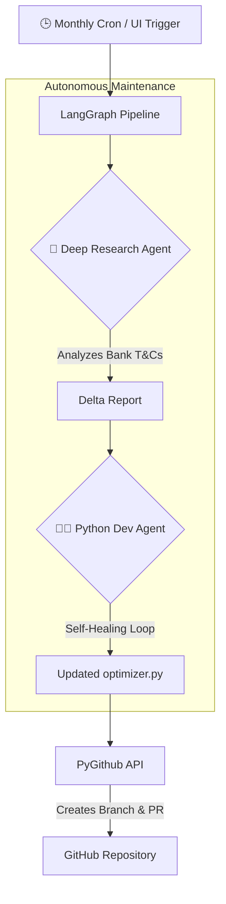

# ✈️ Cathay Miles AI Optimizer (Agentic Edition)

> **Which credit card should I use?** Upload a receipt, type or speak your transaction — get the answer instantly.

**[Try it live →](https://cathay-miles-optimizer.streamlit.app)**


---

## What It Does

A Hong Kong–focused credit card optimizer that determines which card earns the most Asia Miles for any given transaction. Combines **Google Gemini Flash** for visual receipt parsing with a deterministic Python math engine built from verified earn rate data.

**🚀 NEW: Agentic Engine Refresh**
The underlying math engine (`optimizer.py`) is now autonomously maintained by a **LangGraph-based dual-agent AI pipeline**. On the 1st of every month, a Deep Research Agent searches bank sites for updated T&Cs, and a Python Dev Agent writes the updated code, creating a Pull Request seamlessly via the GitHub API.

### Key Features

| Feature | Description |
|---|---|
| 🤖 **Autonomous Engine Updates** | LangGraph AI pipeline researchers and updates math engine autonomously every month via GitHub Actions |
| 📸 **Multi-Image AI Parsing** | Upload multiple receipts at once — Gemini analyzes them together for richer context |
| 🎤 **Voice Input** | Tap-to-speak using browser-native Web Speech API (Chrome/Edge/Safari) |
| 💬 **Text Context** | Type supplementary info to help the AI classify ambiguous transactions |
| 🧮 **Deterministic Engine** | All miles calculations are done in Python, not by AI — guaranteeing mathematical accuracy |
| 📊 **Analytics Dashboard** | Track total miles earned, spending categories, and card utilization with Plotly |
| 💾 **Persistence** | Secure local transaction history stored in SQLite & Supabase pipeline logging |

## Supported Cards

| Card | Best For |
|---|---|
| **Standard Chartered Cathay Mastercard** | Cathay/HK Express flights, partner dining, Octopus AAVS |
| **HSBC EveryMile VISA** | Designated merchants (Starbucks, MTR, Klook), overseas spending |
| **HSBC Red Mastercard** | Online shopping, food delivery, ride-hailing (Uber), designated 8% merchants |
| **HSBC VISA Signature** | Dining (premium & casual), Red Hot Rewards |

## Quick Start

```bash
git clone https://github.com/ypatra2/cathay-miles-optimizer.git
cd cathay-miles-optimizer
pip install -r requirements.txt
```

Create a `.env` file with your [Google AI Studio](https://aistudio.google.com/apikey) API key and Supabase credentials:

```ini
GEMINI_API_KEY=your_key_here
GITHUB_TOKEN=your_pat_for_agentic_prs
SUPABASE_URL=...
SUPABASE_KEY=...
```

Run:

```bash
streamlit run app.py
```

## Agentic Architecture



## Security

- `.env` and `secrets.toml` are gitignored — API keys never leave your machine
- Receipt images are processed in-memory via REST API, never stored to disk
- The AI Agent generates a **Pull Request** and never commits natively to `main`, requiring human-in-the-loop review.

## Geo-Blocking Note

Google's Gemini API is geo-blocked in Hong Kong. If you're in HK, route your network through a VPN (e.g., ProtonVPN) before analyzing receipts or running the deep research pipeline.

---

Built with [Streamlit](https://streamlit.io) · [Google Gemini](https://ai.google.dev) · [LangGraph](https://langchain-ai.github.io/langgraph/) · Hong Kong credit card nerd energy ⚡
