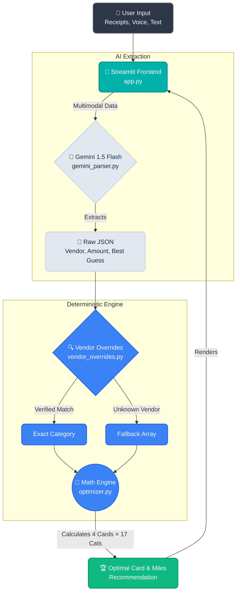

# ✈️ Cathay Miles AI Optimizer

> **Which credit card should I use?** Upload a receipt, type or speak your transaction — get the answer instantly.

**[Try it live →](https://cathay-miles-optimizer.streamlit.app)**


---

## What It Does

A Hong Kong–focused credit card optimizer that determines which card earns the most Asia Miles for any given transaction. Combines **Google Gemini Flash** for visual receipt parsing with a deterministic Python math engine built from verified 2024–2026 earn rate data.

### Key Features

| Feature | Description |
|---|---|
| 📸 **Multi-Image AI Parsing** | Upload multiple receipts at once — Gemini analyzes them together for richer context |
| 🎤 **Voice Input** | Tap-to-speak using browser-native Web Speech API (Chrome/Edge/Safari) |
| 💬 **Text Context** | Type supplementary info to help the AI classify ambiguous transactions |
| 🔍 **Vendor Overrides** | 50+ pre-verified vendor→category mappings bypass AI guessing for known merchants |
| 🧮 **Deterministic Engine** | All miles calculations are done in Python, not by AI — guaranteeing mathematical accuracy |
| 📱 **Responsive UI** | Premium dark-mode design, works on desktop and mobile |

## Supported Cards

| Card | Best For |
|---|---|
| **Standard Chartered Cathay Mastercard** | Cathay/HK Express flights, partner dining, Octopus AAVS |
| **HSBC EveryMile VISA** | Designated merchants (Starbucks, MTR, Klook), overseas spending |
| **HSBC Red Mastercard** | Online shopping, food delivery, ride-hailing (Uber), designated 8% merchants |
| **HSBC VISA Signature** | Dining (premium & casual), Red Hot Rewards |

## Spending Categories (17)

Cathay Pacific · HK Express · Other Airlines (Direct/OTA) · Designated OTA · Non-Designated OTA · EveryMile Designated · Ride-Hailing · Cathay Partner Dining · Dining (Premium/Casual) · Food Delivery · Shopping (Designated 8%) · Online General · In-Store General · Octopus AAVS · Overseas

## Quick Start

```bash
git clone https://github.com/ypatra2/cathay-miles-optimizer.git
cd cathay-miles-optimizer
pip install -r requirements.txt
```

Create a `.env` file with your [Google AI Studio](https://aistudio.google.com/apikey) API key:

```
GEMINI_API_KEY=your_key_here
```

Run:

```bash
streamlit run app.py
```

## Architecture



```
app.py              → Streamlit UI (multi-image upload, voice input, results display)
optimizer.py        → Deterministic miles calculation engine (17 categories × 4 cards)
gemini_parser.py    → Gemini Flash API integration (multi-image + text context)
vendor_overrides.py → Verified vendor→category mappings (bypasses AI for known merchants)
speech_input.py     → Browser Web Speech API component (inline HTML, no dependencies)
```

## Security

- `.env` and `secrets.toml` are gitignored — API keys never leave your machine
- Receipt images are processed in-memory via REST API, never stored to disk
- No telemetry, no analytics, no tracking

## Geo-Blocking Note

Google's Gemini API is geo-blocked in Hong Kong. If you're in HK, route your network through a VPN (e.g., ProtonVPN) before analyzing receipts. The app provides a clear error message when geo-blocked.

---

Built with [Streamlit](https://streamlit.io) · [Google Gemini](https://ai.google.dev) · Hong Kong credit card nerd energy ⚡
